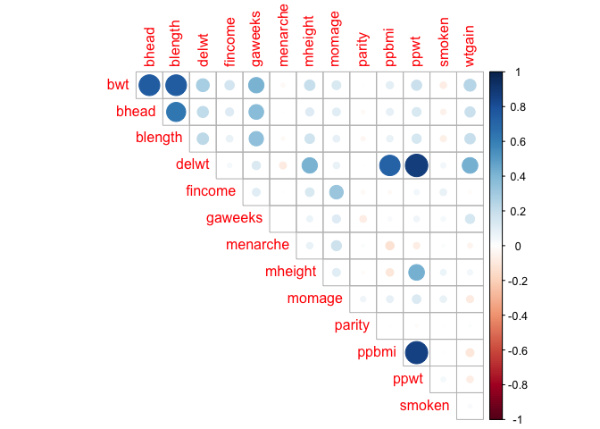
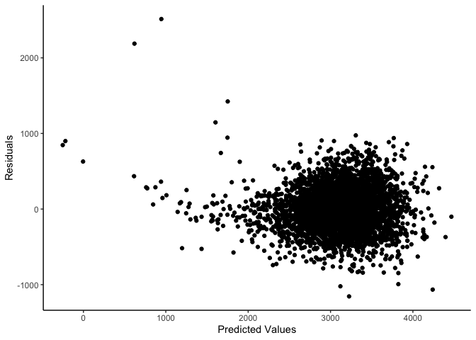
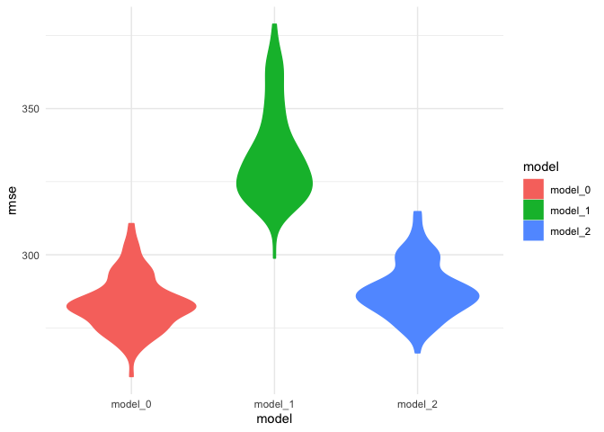
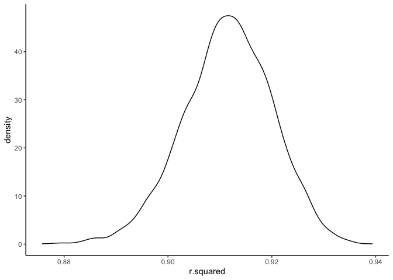

P8105 - Homework 6
================
Mingkuan Xu

``` r
library(tidyverse)
library(corrplot)
library(modelr)
library(mgcv)
```

## Problem 1

### Part 1 - Data Preprocessing

``` r
birth_data = read_csv("birthweight.csv") %>%
  janitor::clean_names() %>%
  mutate(
    # parents' race, babysex and malform should be factored
    frace = as.factor(frace),
    mrace = as.factor(mrace),
    babysex = as.factor(babysex),
    malform = as.factor(malform))

# Calculate number of missing values
sum(is.na(birth_data))
```

    ## [1] 0

### Part 2 - Build Model

To build a regression model for the birth weight, we start by taking a
closer look of each variables, calculate the pairwise correlations
between variables, and list all the correlations between the birth
weight and all other variables. Notice that for columns pnumlbw and
pnumgsa, all values are zero so we remove them.

``` r
birth_data_cor = birth_data %>%
  select(-babysex,-frace,-mrace,-malform,-pnumlbw,-pnumsga) %>%
  relocate(bwt) %>%
  cor(use="complete.obs")
corrplot(birth_data_cor, type = "upper", diag = FALSE)
```

<!-- -->

Now we observe from the heatmap that bwt is associated with bhead,
blength, delwt, and gaweeks, we consider building a simple regression
model using these variables.

``` r
model = lm(bwt ~ bhead + blength + delwt + gaweeks, data = birth_data)
summary(model)
```

    ## 
    ## Call:
    ## lm(formula = bwt ~ bhead + blength + delwt + gaweeks, data = birth_data)
    ## 
    ## Residuals:
    ##      Min       1Q   Median       3Q      Max 
    ## -1155.18  -183.25    -9.65   176.21  2513.16 
    ## 
    ## Coefficients:
    ##               Estimate Std. Error t value Pr(>|t|)    
    ## (Intercept) -6249.5265    95.3679 -65.531   <2e-16 ***
    ## bhead         135.8153     3.5021  38.781   <2e-16 ***
    ## blength        79.1451     2.0739  38.162   <2e-16 ***
    ## delwt           2.0402     0.1995  10.228   <2e-16 ***
    ## gaweeks        14.1812     1.4916   9.507   <2e-16 ***
    ## ---
    ## Signif. codes:  0 '***' 0.001 '**' 0.01 '*' 0.05 '.' 0.1 ' ' 1
    ## 
    ## Residual standard error: 282.8 on 4337 degrees of freedom
    ## Multiple R-squared:  0.6954, Adjusted R-squared:  0.6951 
    ## F-statistic:  2476 on 4 and 4337 DF,  p-value: < 2.2e-16

``` r
birth_data %>%
  modelr::add_residuals(model) %>% 
  modelr::add_predictions(model) %>%
  ggplot(aes(x = pred, y = resid)) + 
  labs(
    x = "Predicted Values",
    y = "Residuals"
  ) + 
  geom_point() +
  theme_classic()
```

<!-- -->

### Part 3 - Compare With Other Models

``` r
model_1 = lm(bwt ~ blength + gaweeks, data = birth_data)
summary(model_1)
```

    ## 
    ## Call:
    ## lm(formula = bwt ~ blength + gaweeks, data = birth_data)
    ## 
    ## Residuals:
    ##     Min      1Q  Median      3Q     Max 
    ## -1709.6  -215.4   -11.4   208.2  4188.8 
    ## 
    ## Coefficients:
    ##              Estimate Std. Error t value Pr(>|t|)    
    ## (Intercept) -4347.667     97.958  -44.38   <2e-16 ***
    ## blength       128.556      1.990   64.60   <2e-16 ***
    ## gaweeks        27.047      1.718   15.74   <2e-16 ***
    ## ---
    ## Signif. codes:  0 '***' 0.001 '**' 0.01 '*' 0.05 '.' 0.1 ' ' 1
    ## 
    ## Residual standard error: 333.2 on 4339 degrees of freedom
    ## Multiple R-squared:  0.5769, Adjusted R-squared:  0.5767 
    ## F-statistic:  2958 on 2 and 4339 DF,  p-value: < 2.2e-16

``` r
model_2 = lm(bwt ~ bhead + blength + babysex + 
               bhead*blength + bhead * babysex + blength*babysex +
               bhead*blength*babysex,
             data = birth_data)
summary(model_2)
```

    ## 
    ## Call:
    ## lm(formula = bwt ~ bhead + blength + babysex + bhead * blength + 
    ##     bhead * babysex + blength * babysex + bhead * blength * babysex, 
    ##     data = birth_data)
    ## 
    ## Residuals:
    ##      Min       1Q   Median       3Q      Max 
    ## -1132.99  -190.42   -10.33   178.63  2617.96 
    ## 
    ## Coefficients:
    ##                          Estimate Std. Error t value Pr(>|t|)    
    ## (Intercept)            -7176.8170  1264.8397  -5.674 1.49e-08 ***
    ## bhead                    181.7956    38.0542   4.777 1.84e-06 ***
    ## blength                  102.1269    26.2118   3.896 9.92e-05 ***
    ## babysex2                6374.8684  1677.7669   3.800 0.000147 ***
    ## bhead:blength             -0.5536     0.7802  -0.710 0.478012    
    ## bhead:babysex2          -198.3932    51.0917  -3.883 0.000105 ***
    ## blength:babysex2        -123.7729    35.1185  -3.524 0.000429 ***
    ## bhead:blength:babysex2     3.8781     1.0566   3.670 0.000245 ***
    ## ---
    ## Signif. codes:  0 '***' 0.001 '**' 0.01 '*' 0.05 '.' 0.1 ' ' 1
    ## 
    ## Residual standard error: 287.7 on 4334 degrees of freedom
    ## Multiple R-squared:  0.6849, Adjusted R-squared:  0.6844 
    ## F-statistic:  1346 on 7 and 4334 DF,  p-value: < 2.2e-16

``` r
cv_df = crossv_mc(birth_data, 100) %>% 
  mutate(
    train = map(train, as_tibble),
    test = map(test, as_tibble),
    model_0  = map(train, ~lm(bwt ~ bhead + blength + delwt + gaweeks, data = .)),
    model_1  = map(train, ~lm(bwt ~ blength + gaweeks, data = .)),
    model_2  = map(train, ~lm(bwt ~ bhead + blength + babysex + 
               bhead*blength + bhead * babysex + blength*babysex +
               bhead*blength*babysex,
             data = birth_data))) %>% 
  mutate(
    rmse_model_0 = map2_dbl(model_0, test, ~rmse(model = .x, data = .y)),
    rmse_model_1 = map2_dbl(model_1, test, ~rmse(model = .x, data = .y)),
    rmse_model_2 = map2_dbl(model_2, test, ~rmse(model = .x, data = .y))) %>%
  select(starts_with('rmse')) %>%
  pivot_longer(
    everything(),
    names_to = "model",
    values_to = "rmse",
    names_prefix = "rmse_") %>%
  mutate(model = fct_inorder(model)) 

ggplot(cv_df,aes(x = model, y = rmse, fill = model, color = model)) + 
    geom_violin() +
    theme_minimal()
```

<!-- -->

From the violin plot shown above, we can conclude the model fitted using
head circumference, length, sex, and all interactions (including the
three-way interaction) is the best, since it has the smallest rmse
value; the model fitting using length at birth and gestational age is
the worst,since it has the biggest rmse value.

## Problem 2

### Part 1 - Load Data

``` r
weather_df = 
  rnoaa::meteo_pull_monitors(
    c("USW00094728"),
    var = c("PRCP", "TMIN", "TMAX"), 
    date_min = "2017-01-01",
    date_max = "2017-12-31") %>%
  mutate(
    name = recode(id, USW00094728 = "CentralPark_NY"),
    tmin = tmin / 10,
    tmax = tmax / 10) %>%
  select(name, id, everything())
```

### Part 2 - Bootstrap

``` r
weather_bootstrap = weather_df %>% 
  modelr::bootstrap(n = 5000) %>% 
  mutate(
    models = map(strap, ~lm(tmax ~ tmin, data = .x)),
    results = map(models, broom::tidy),
    r_square = map(models, broom::glance))

weather_bootstrap_rsquare =  weather_bootstrap %>% 
#  select(results, r_square) %>%
#  unnest(results, r_square)
  unnest(r_square) %>% 
  select(r.squared)

ggplot(weather_bootstrap_rsquare,aes(x = r.squared)) + 
  geom_density() + theme_classic()
```

<!-- -->

``` r
weather_bootstrap_rsquare %>%
  summarise("Lower CI" = quantile(r.squared, probs = 0.025),
            "Upper CI" = quantile(r.squared, probs = 0.975)) %>% 
  knitr::kable(digits = 3)
```

| Lower CI | Upper CI |
|---------:|---------:|
|    0.894 |    0.927 |

``` r
weather_bootstrap_logbeta = weather_bootstrap %>% 
  unnest(results) 
```
